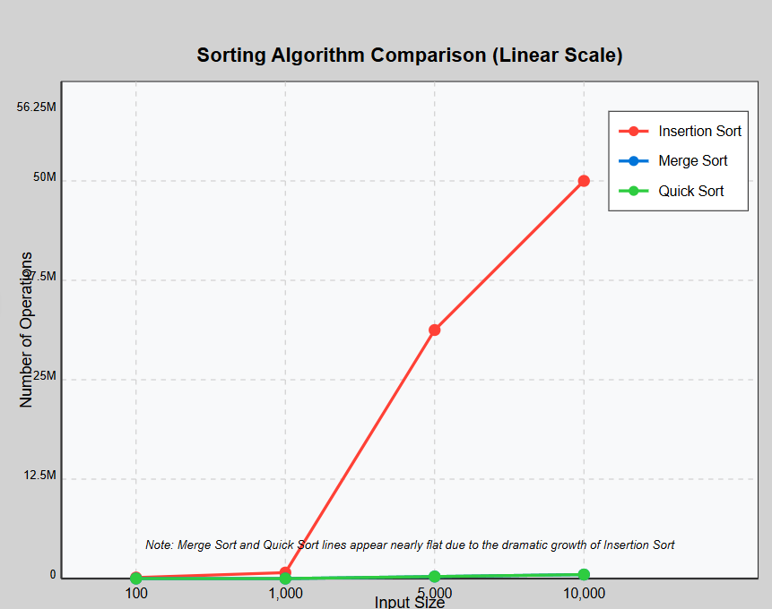
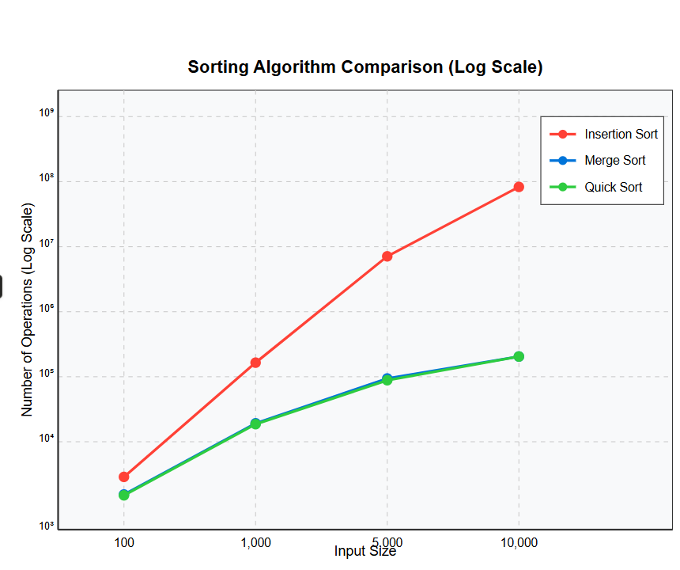

# Sorting Algorithm Benchmark

A C++ benchmark comparing insertion sort, merge sort, and quicksort across increasingly large randomized inputs. The program counts comparisons and swaps, exports results, and supports Gnuplot visualizations on linear and logarithmic scales.

## Measured results

| Input size | Insertion total operations | Merge total operations | Quick total operations |
| ---: | ---: | ---: | ---: |
| 100 | 4,518 | 1,221 | 1,052 |
| 1,000 | 486,487 | 18,675 | 18,488 |
| 5,000 | 12,480,130 | 117,019 | 105,933 |
| 10,000 | 49,784,822 | 254,072 | 252,819 |

The measured growth illustrates insertion sort's quadratic behavior and the substantially better scaling of merge sort and quicksort.

## Visualizations





## Build and run

```console
g++ -std=c++17 -O2 main.cpp -o sorting-benchmark
./sorting-benchmark
```

With Gnuplot installed, run `generate_all_plots.sh` to regenerate the charts.

## Skills demonstrated

- C++ algorithm implementation
- Experimental algorithm analysis
- Comparisons and swap instrumentation
- CSV export and Gnuplot visualization
- Relating measured behavior to Big-O complexity

## Author

Ahmed Balde
